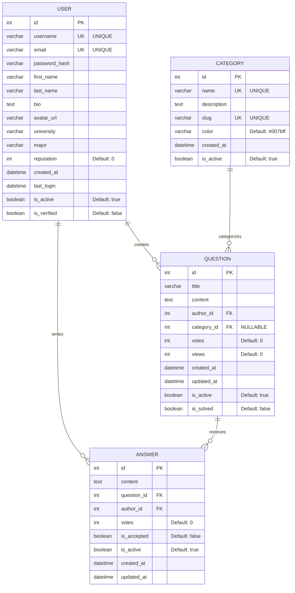

# Esquema Entidad-Relación - StudentOverflow

## Diagrama ERD



## Descripción de Entidades

### USER (Usuarios)

**Tabla:** `users`

Almacena la información de los estudiantes registrados en la plataforma.

| Campo           | Tipo         | Restricciones      | Descripción                     |
| --------------- | ------------ | ------------------ | ------------------------------- |
| `id`            | INTEGER      | PK, AUTO_INCREMENT | Identificador único del usuario |
| `username`      | VARCHAR(80)  | UNIQUE, NOT NULL   | Nombre de usuario único         |
| `email`         | VARCHAR(120) | UNIQUE, NOT NULL   | Correo electrónico único        |
| `password_hash` | VARCHAR(200) | NOT NULL           | Contraseña hasheada             |
| `first_name`    | VARCHAR(50)  | NOT NULL           | Nombre del usuario              |
| `last_name`     | VARCHAR(50)  | NOT NULL           | Apellido del usuario            |
| `bio`           | TEXT         | NULLABLE           | Biografía del usuario           |
| `avatar_url`    | VARCHAR(200) | NULLABLE           | URL del avatar                  |
| `university`    | VARCHAR(100) | NULLABLE           | Universidad del estudiante      |
| `major`         | VARCHAR(100) | NULLABLE           | Carrera del estudiante          |
| `reputation`    | INTEGER      | DEFAULT 0          | Puntos de reputación            |
| `created_at`    | DATETIME     | DEFAULT NOW()      | Fecha de registro               |
| `last_login`    | DATETIME     | NULLABLE           | Último inicio de sesión         |
| `is_active`     | BOOLEAN      | DEFAULT TRUE       | Usuario activo                  |
| `is_verified`   | BOOLEAN      | DEFAULT FALSE      | Email verificado                |

### CATEGORY (Categorías)

**Tabla:** `categories`

Clasifica las preguntas por áreas de estudio.

| Campo         | Tipo         | Restricciones      | Descripción                      |
| ------------- | ------------ | ------------------ | -------------------------------- |
| `id`          | INTEGER      | PK, AUTO_INCREMENT | Identificador único de categoría |
| `name`        | VARCHAR(100) | UNIQUE, NOT NULL   | Nombre de la categoría           |
| `description` | TEXT         | NULLABLE           | Descripción detallada            |
| `slug`        | VARCHAR(100) | UNIQUE, NOT NULL   | URL-friendly identifier          |
| `color`       | VARCHAR(7)   | DEFAULT '#007bff'  | Color hexadecimal                |
| `created_at`  | DATETIME     | DEFAULT NOW()      | Fecha de creación                |
| `is_active`   | BOOLEAN      | DEFAULT TRUE       | Categoría activa                 |

### QUESTION (Preguntas)

**Tabla:** `questions`

Almacena las preguntas realizadas por los estudiantes.

| Campo         | Tipo         | Restricciones                | Descripción                     |
| ------------- | ------------ | ---------------------------- | ------------------------------- |
| `id`          | INTEGER      | PK, AUTO_INCREMENT           | Identificador único de pregunta |
| `title`       | VARCHAR(200) | NOT NULL                     | Título de la pregunta           |
| `content`     | TEXT         | NOT NULL                     | Contenido detallado             |
| `author_id`   | INTEGER      | FK → users.id, NOT NULL      | Usuario que hizo la pregunta    |
| `category_id` | INTEGER      | FK → categories.id, NULLABLE | Categoría de la pregunta        |
| `votes`       | INTEGER      | DEFAULT 0                    | Votos positivos/negativos       |
| `views`       | INTEGER      | DEFAULT 0                    | Número de visualizaciones       |
| `created_at`  | DATETIME     | DEFAULT NOW()                | Fecha de creación               |
| `updated_at`  | DATETIME     | DEFAULT NOW()                | Última actualización            |
| `is_active`   | BOOLEAN      | DEFAULT TRUE                 | Pregunta activa                 |
| `is_solved`   | BOOLEAN      | DEFAULT FALSE                | Pregunta resuelta               |

### ANSWER (Respuestas)

**Tabla:** `answers`

Contiene las respuestas a las preguntas de los estudiantes.

| Campo         | Tipo     | Restricciones               | Descripción                      |
| ------------- | -------- | --------------------------- | -------------------------------- |
| `id`          | INTEGER  | PK, AUTO_INCREMENT          | Identificador único de respuesta |
| `content`     | TEXT     | NOT NULL                    | Contenido de la respuesta        |
| `question_id` | INTEGER  | FK → questions.id, NOT NULL | Pregunta que responde            |
| `author_id`   | INTEGER  | FK → users.id, NOT NULL     | Usuario que respondió            |
| `votes`       | INTEGER  | DEFAULT 0                   | Votos positivos/negativos        |
| `is_accepted` | BOOLEAN  | DEFAULT FALSE               | Respuesta aceptada               |
| `is_active`   | BOOLEAN  | DEFAULT TRUE                | Respuesta activa                 |
| `created_at`  | DATETIME | DEFAULT NOW()               | Fecha de creación                |
| `updated_at`  | DATETIME | DEFAULT NOW()               | Última actualización             |

## Relaciones

### 1. USER → QUESTION (1:N)

- **Cardinalidad:** Un usuario puede crear múltiples preguntas
- **Restricción:** Cada pregunta debe tener un autor
- **Integridad:** CASCADE DELETE (al eliminar usuario, se desactivan sus preguntas)

### 2. USER → ANSWER (1:N)

- **Cardinalidad:** Un usuario puede escribir múltiples respuestas
- **Restricción:** Cada respuesta debe tener un autor
- **Integridad:** CASCADE DELETE (al eliminar usuario, se desactivan sus respuestas)

### 3. CATEGORY → QUESTION (1:N)

- **Cardinalidad:** Una categoría puede tener múltiples preguntas
- **Restricción:** Una pregunta puede no tener categoría (NULLABLE)
- **Integridad:** SET NULL (al eliminar categoría, pregunta queda sin categoría)

### 4. QUESTION → ANSWER (1:N)

- **Cardinalidad:** Una pregunta puede tener múltiples respuestas
- **Restricción:** Cada respuesta debe estar asociada a una pregunta
- **Integridad:** CASCADE DELETE (al eliminar pregunta, se eliminan sus respuestas)

## Índices Recomendados

```sql
-- Índices para rendimiento
CREATE INDEX idx_questions_author_id ON questions(author_id);
CREATE INDEX idx_questions_category_id ON questions(category_id);
CREATE INDEX idx_questions_created_at ON questions(created_at DESC);
CREATE INDEX idx_answers_question_id ON answers(question_id);
CREATE INDEX idx_answers_author_id ON answers(author_id);
CREATE INDEX idx_users_email ON users(email);
CREATE INDEX idx_users_username ON users(username);

-- Índices compuestos para consultas frecuentes
CREATE INDEX idx_questions_active_solved ON questions(is_active, is_solved);
CREATE INDEX idx_answers_accepted_votes ON answers(is_accepted, votes DESC);
```

## Restricciones de Integridad

### Claves Primarias

- Todas las tablas tienen `id` como clave primaria auto-incremental

### Claves Únicas

- `users.username` - Nombres de usuario únicos
- `users.email` - Correos electrónicos únicos
- `categories.name` - Nombres de categoría únicos
- `categories.slug` - Slugs únicos para URLs

### Claves Foráneas

- `questions.author_id` → `users.id`
- `questions.category_id` → `categories.id` (NULLABLE)
- `answers.question_id` → `questions.id`
- `answers.author_id` → `users.id`

### Restricciones de Dominio

- `reputation` ≥ 0
- `votes` puede ser negativo
- `views` ≥ 0
- `color` formato hexadecimal válido

## Estimaciones de Volumen

### Datos Iniciales

- **Usuarios:** ~100-1000 estudiantes
- **Categorías:** ~10-20 áreas de estudio
- **Preguntas:** ~500-5000 preguntas
- **Respuestas:** ~1000-15000 respuestas

### Crecimiento Proyectado (por año)

- **Usuarios:** +200-500 nuevos estudiantes
- **Preguntas:** +1000-5000 nuevas preguntas
- **Respuestas:** +2000-10000 nuevas respuestas

---

**Autor:** StudentOverflow Team  
**Fecha:** Julio 2025  
**Versión:** 1.0  
**Checkpoint:** 2
